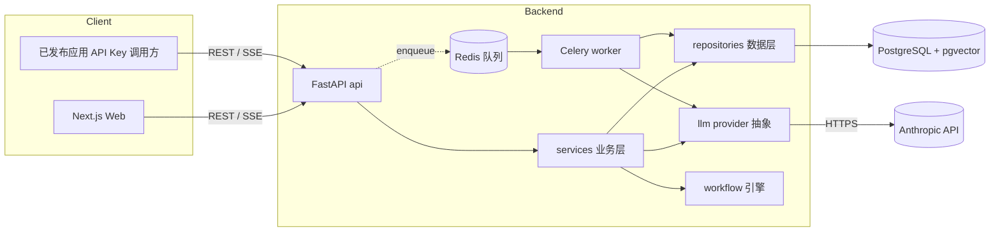
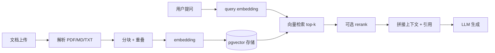
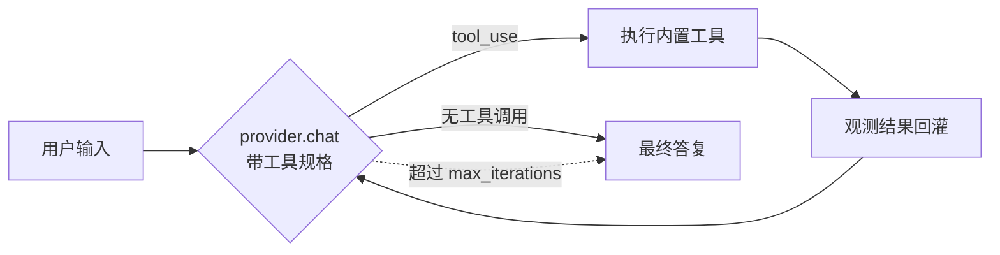

# 架构设计文档 —— 定制化 LLM 应用平台

> 对标 Dify 能力模型,**不使用 Dify 源码**,从零构建。本文档描述系统的目标、技术栈、分层架构、核心数据模型与关键子系统设计。
>
> **状态:四大能力链路(对话 / RAG / 工作流 / Agent)D1–D7 全部落地并实测通过。** 图文并茂的总览见 [docs/site/index.html](./site/index.html)。

## 1. 目标与范围

构建一个 LLM 应用开发平台,一周内产出可运行 MVP,覆盖四大能力:

| 能力 | 说明 |
|---|---|
| 对话应用(Chatbot) | 流式对话、Prompt 配置、会话/消息历史 |
| 知识库 RAG | 文档上传 → 分块 → embedding → pgvector 检索 → 引用注入 |
| 可视化工作流 | 节点编排引擎 + React Flow 编辑器(LLM / 检索 / 条件 / 代码 节点) |
| Agent + 工具调用 | Function calling、内置工具、ReAct 循环 |

**非目标(MVP 之外)**:多租户计费、企业 SSO、模型微调、插件市场。

## 2. 技术栈

| 层 | 选型 |
|---|---|
| 后端 | Python 3.12 · FastAPI · SQLAlchemy 2.0 (async) · Alembic · Pydantic v2 |
| 异步任务 | Celery + Redis(文档分块、embedding、长任务) |
| 数据库 | PostgreSQL 16 + **pgvector**(关系数据与向量同库,少一个服务) |
| 缓存/队列 | Redis 7 |
| 前端 | Next.js 16 (App Router) · React 19 · TypeScript · Tailwind v4 · React Flow(`@xyflow/react`)· AG Grid 社区版 |
| LLM | 首选 Claude(`claude-opus-4-8` / `claude-sonnet-4-6`),Anthropic SDK;经 provider 抽象 |
| 包管理 | 后端 `uv`,前端 `pnpm` |
| 部署 | docker compose(无 `version` 头):`api` / `worker` / `web` / `db` / `redis` |

## 3. 系统架构



## 4. 后端分层架构

请求严格单向流动:**api → services → repositories → models**。

```
backend/app/
  api/           # 路由层:HTTP 解析/校验(Pydantic),依赖注入,调 service。薄,无业务逻辑。
  services/      # 业务逻辑层:编排 repository / llm / workflow。
  repositories/  # 数据访问层:封装 SQLAlchemy 查询。唯一写 SQL 的地方。
  models/        # ORM 模型(SQLAlchemy)。
  schemas/       # Pydantic 输入/输出 DTO。
  core/          # 配置、鉴权、依赖、异常、日志。
  llm/           # 模型 provider 抽象 + Anthropic/OpenAI 实现 + 双格式线转换。
  workflow/      # 工作流节点执行引擎(拓扑排序 + 变量池 + 条件分支)。
  agent/         # Agent 内置工具注册表 + ReAct(function calling)循环。
  tasks/         # Celery 任务(文档分块/embedding)。
  core/          # 配置、鉴权、依赖、可观测(请求日志/指标)。
  main.py        # FastAPI 应用入口。
alembic/         # 数据库迁移。
```

**铁律**:路由层不得直接访问 repository/model;service 不写裸 SQL;LLM 调用一律走 `llm/` 抽象,不在业务里硬编码厂商 SDK。

## 5. 核心数据模型

遵循命名规范:snake_case、表名单数 + 模块前缀、每表含 `id`/`created_at`/`updated_at`(UTC)、软删除 `deleted_at`、约束 `pk_`/`uk_`/`fk_`/`idx_`。下为关键表(字段从略,仅示意结构):

| 模块 | 表 | 说明 |
|---|---|---|
| 鉴权 | `auth_user` | 用户 |
| | `auth_api_key` | 已发布应用的访问密钥 |
| 应用 | `app_app` | 应用(类型:chatbot / workflow / agent) |
| | `app_app_config` | 应用配置(prompt、模型、参数,版本化) |
| | `app_conversation` | 会话 |
| | `app_message` | 消息(role、content、token 统计、引用) |
| 知识库 | `kb_dataset` | 知识库 |
| | `kb_document` | 文档 |
| | `kb_segment` | 分块,含 `embedding vector(768)` 列(匹配讯飞 `xop3qwen8bembedding`)+ 向量索引 |
| 工作流 | `wf_workflow` | 工作流定义(graph JSON) |
| | `wf_node_run` | 节点执行记录(输入/输出/耗时/状态) |
| | `wf_run` | 工作流运行实例 |
| Agent | `agent_tool` | Agent 应用启用的内置工具(type=内置键、name、config、is_enabled),挂 `app_id` |
| | `agent_thought` | ReAct 轨迹步骤(kind=thought/tool_call/observation/answer),按 `message_id` 回放 |

> 所有迁移用 `/db-migration` 技能生成,确保命名规范不跑偏。

## 6. LLM 抽象 —— 双格式(Anthropic + OpenAI)

平台在**上游**与**下游**两个方向都同时兼容 Anthropic 与 OpenAI 两种格式。

### 6.1 上游适配(`app/llm/`)

统一内部表示(`ChatRequest` / `ChatResult` / `ToolSpec` / `ToolCall`),两个 adapter 屏蔽厂商差异:

```python
class LLMProvider(Protocol):
    name: str
    default_model: str
    async def chat(self, req: ChatRequest) -> ChatResult: ...
    def stream(self, req: ChatRequest) -> AsyncIterator[str]: ...        # 文本增量
    async def embed(self, texts, *, model=None) -> list[list[float]]: ...
```

- `AnthropicProvider` —— Anthropic Messages API(Claude,或任意 Anthropic 兼容网关,如讯飞 `/anthropic`)。
- `OpenAIProvider` —— OpenAI Chat Completions(改 `base_url` 即接 GPT / DeepSeek / vLLM / Ollama / 讯飞 `/v2` 等)。
- `factory.resolve_provider(model)` 按模型名路由(`claude*`→anthropic,`gpt*/deepseek*/...`→openai),否则用 `LLM_PROVIDER` 默认。
- 上层(service / workflow / agent)只依赖 `LLMProvider`,格式无关。
- embedding 走 OpenAI 兼容端点(Anthropic 无原生 embedding)。

### 6.2 下游网关(`app/api/llm_gateway.py`)

对外同时暴露两种线格式端点,**请求格式与上游 provider 解耦**(纯转换函数在 `app/llm/wire.py`):

| 端点 | 入参格式 | 出参格式 |
|---|---|---|
| `POST /v1/chat/completions` | OpenAI | OpenAI(含 SSE 流 + `[DONE]`) |
| `POST /v1/messages` | Anthropic | Anthropic(含 SSE 事件流) |
| `POST /v1/embeddings` | OpenAI | OpenAI |

客户端用 OpenAI SDK 请求 `model="claude-*"` 也能打到 Anthropic 上游(反之亦然)。已用讯飞 MaaS 双端点实测:OpenAI 格式入 ↔ Anthropic 上游、Anthropic 格式入 ↔ OpenAI 上游,非流式/流式均通过。

### 6.3 工具结果回传(D7 扩展)

为支撑 Agent 多轮 function calling,`Message` 抽象扩展了 `tool_calls`(assistant 轮请求的工具)与 `tool_call_id`(role=tool 的返回归属);两个 provider 各自序列化为对应线格式:

- OpenAI:`assistant.tool_calls[]` + `role:"tool"` 结果消息。
- Anthropic:assistant 的 `tool_use` 块 + user 的 `tool_result` 块(连续结果合并进同一 user 消息)。

> 网关(`/v1/*`)仍为 MVP 未鉴权;对外应用调用走 `auth_api_key` 的 `/v1/apps/{id}/chat`(D4 已实现按 key 鉴权 + `last_used_at` 计量)。

## 7. RAG 管线



- 上传时同步解析 PDF/MD/TXT 为文本落库;分块 + embedding 为重任务,走 **Celery worker** 异步;文档状态机:`pending → processing → ready / error`。
- 检索用 pgvector cosine + `idx_kb_segment_embedding`;embedding 维度由 `EMBEDDING_DIM` 决定(实测讯飞 768 维)。
- 对话链路:`ChatIn.dataset_id` → 检索 top-k → 拼进 system 上下文 → 生成,SSE `meta` 回传引用,前端折叠溯源。

## 8. 工作流引擎

- 工作流以 **有向图**(节点 + 边)存储为 JSON(`wf_workflow.graph`)。
- 执行器做拓扑排序后逐节点执行,节点间用变量池传递数据(`{{node_id.output}}`)。
- MVP 节点类型:`start` / `end` / `llm` / `knowledge_retrieval` / `condition`(if-else)/ `code`(沙箱执行)/ `template`。
- 每个节点实现统一接口 `async def run(inputs, context) -> outputs`;新增节点类型只加一个执行器 + 一个 React Flow 节点组件。
- 运行记录落 `wf_run` / `wf_node_run`,前端可回放每个节点的输入输出。
- 前端用 **React Flow** 做拖拽编排,图结构与后端 `graph` JSON 双向同步。

## 9. Agent 设计

- Agent 是一种应用类型(`app_app.mode = "agent"`),复用应用配置(模型/system/参数/绑定知识库)与会话/消息体系。
- 基于 **function-calling ReAct 循环**(`app/agent/react.py`):带工具规格调 `provider.chat` → 若返回 tool_use 则执行工具、把观测回灌进上下文 → 迭代,直到无工具调用产出最终答复,或达 `AGENT_MAX_ITERATIONS`(默认 6)兜底。
- 内置工具注册表(`app/agent/tools.py`),每个工具声明 JSON Schema + `execute`:
  - `knowledge_retrieval` —— 复用 RAG 检索(dataset_id 可单配,缺省回退应用绑定库)。
  - `http_request` —— GET/POST,仅 http(s),可配 `allow_url_prefix` 限制目标、响应截断。
  - `code_exec` —— 受限 builtins 执行 Python,取 `result` 变量。
- 启用的工具按 `app_id` 存 `agent_tool`(同类型至多一个);运行轨迹逐步落 `agent_thought`,经 SSE 实时推送(thought/tool_call/observation/answer),并可按消息回放。



## 10. 鉴权与发布

- 平台内部:JWT(登录态),`core/` 提供依赖注入式鉴权。
- 已发布应用对外:`auth_api_key`,按 key 限流与计量。
- 应用配置版本化(`app_app_config`),发布即锁定一个版本。

## 11. 可观测(D7)

- **请求日志**:`RequestLoggingMiddleware` 为每个请求生成 `X-Request-ID`,输出结构化 JSON 一行(method/path/status/耗时),并兜底未捕获异常(记堆栈 + 返回统一 500)。
- **进程指标**:`GET /api/metrics` 暴露累计请求数 / 错误数 / 平均时延 / 状态码分布(无鉴权,便于探活采集)。
- **token 计量**:`GET /api/metrics/usage`(需鉴权)按模型汇总当前用户助手消息的 input/output token。
- 生产可平滑替换为 Prometheus / OpenTelemetry;日志已是结构化 JSON,接采集即可。

## 12. 部署

`docker compose`(无 `version` 头)五服务,`up -d --build` 一键起全栈:

| 服务 | 镜像/构建 | 职责 |
|---|---|---|
| `db` | pgvector/pgvector:pg16 | 关系数据 + 向量(宿主机 5433→5432) |
| `redis` | redis:7 | 缓存 + Celery broker/backend |
| `api` | backend Dockerfile | FastAPI;**启动前自动 `alembic upgrade head`** |
| `worker` | backend Dockerfile | Celery worker |
| `web` | web Dockerfile | Next.js standalone |

本地开发:`docker compose up -d db redis`,api/web 本地热重载;迁移 `uv run alembic upgrade head`。详见 [部署文档](./deployment.md)。

## 13. 关键设计权衡

| 决策 | 取舍 |
|---|---|
| pgvector 而非独立向量库 | 一周内少运维一个服务;数据量上来后可换 Qdrant/Weaviate |
| FastAPI(async)而非 Flask | 流式 SSE + 高并发友好,生态现代 |
| Claude 优先 + provider 抽象 | 默认最强模型,又保留多模型扩展口 |
| Celery 处理重任务 | 文档/embedding 不阻塞请求,可水平扩展 worker |
| 工作流图存 JSON | 灵活、前后端同构;牺牲部分查询能力 |
